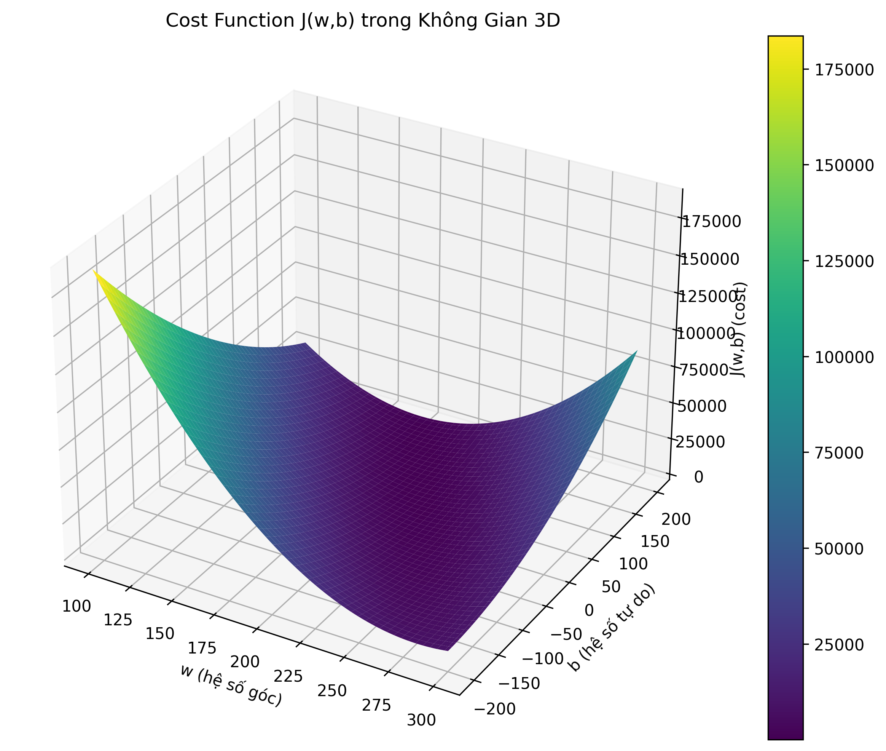
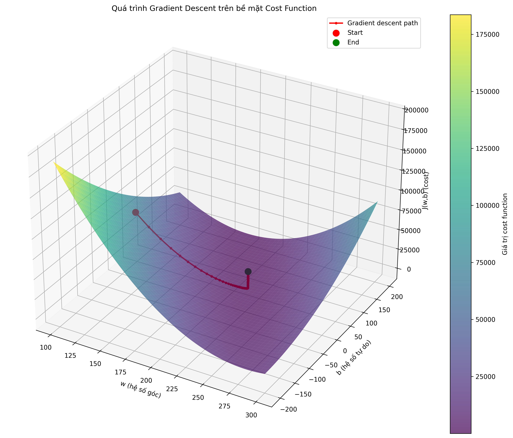
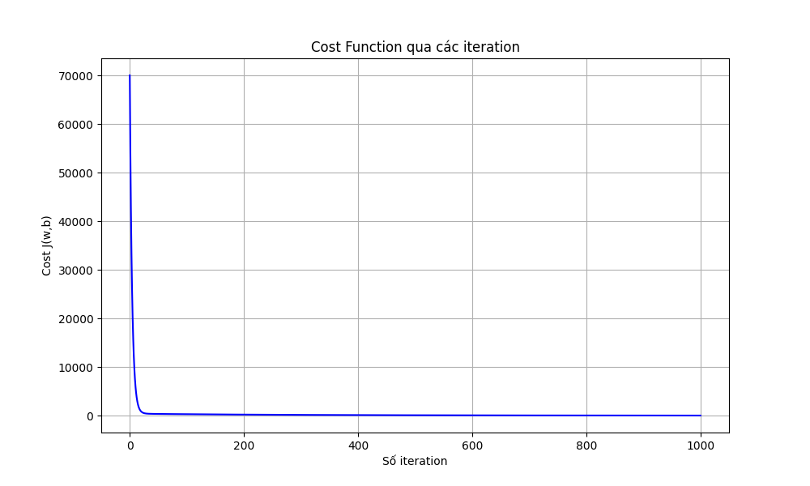

# Ứng Dụng Giải Tích và Học Máy

Tập hợp ví dụ minh họa về các phép toán vector và ứng dụng trong học máy, tập trung vào cost function và gradient descent.

## Cấu Trúc Dự Án

```
calculus-machine-learning/
├── README.md                 # Tài liệu hướng dẫn và mô tả dự án
├── requirements.txt          # Danh sách các thư viện phụ thuộc
├── setup.py                  # File cấu hình cho việc cài đặt package
├── src/
│   └── calculus_ml/         # Package chính
│       ├── __init__.py      # Khởi tạo package và export các hàm chính
│       ├── core/            # Module chứa các hàm tính toán cốt lõi
│       │   ├── vector.py    # Các phép toán vector cơ bản (cộng, trừ, tích vô hướng)
│       │   ├── cost_function.py    # Tính toán cost function và tạo dữ liệu mẫu
│       │   └── gradient_descent.py # Cài đặt thuật toán gradient descent
│       └── visualization/    # Module chứa các hàm vẽ đồ thị
│           ├── cost_plot.py        # Vẽ đồ thị cost function và kết quả hồi quy
│           └── gradient_plot.py    # Vẽ đồ thị quá trình gradient descent
└── images/                  # Thư mục lưu các hình ảnh được tạo ra
    ├── cost_function_3d.png        # Bề mặt cost function trong không gian 3D
    ├── cost_function_contour.png   # Đường đồng mức của cost function
    ├── gradient_descent_3d.png     # Quá trình gradient descent trên bề mặt 3D
    ├── gradient_descent_contour.png # Quá trình gradient descent trên contour
    ├── gradient_descent_steps.png   # Các bước của gradient descent
    └── cost_history.png            # Lịch sử cost function qua các iteration
```

## Tính Năng Chính

1. **Phép Toán Vector Cơ Bản**
   - Cộng, trừ vector
   - Nhân vector với số vô hướng
   - Tích vô hướng (dot product)
   - Chuẩn hóa vector (normalization)

2. **Cost Function trong Học Máy**
   - Tính toán cost function J(w,b)
   - Trực quan hóa bề mặt cost 3D
   - Vẽ đường đồng mức của cost function
   - Hỗ trợ cả mô hình 1 tham số và 2 tham số

3. **Gradient Descent**
   - Tính gradient của cost function
   - Cài đặt thuật toán gradient descent
   - Trực quan hóa quá trình tối ưu
   - Theo dõi sự hội tụ qua các iteration

## Chi Tiết Các Hàm Chính

### 1. Vector Operations (`vector.py`)

```python
def dot_product(v1, v2):
    """
    Tính tích vô hướng của hai vector
    Ví dụ: dot_product([1, 2], [3, 4]) -> 11
    """
    return sum(x * y for x, y in zip(v1, v2))

def vector_norm(v):
    """
    Tính độ dài (norm) của vector
    Ví dụ: vector_norm([3, 4]) -> 5.0
    """
    return np.sqrt(sum(x * x for x in v))

def normalize_vector(v):
    """
    Chuẩn hóa vector thành vector đơn vị
    Ví dụ: normalize_vector([3, 4]) -> [0.6, 0.8]
    """
    norm = vector_norm(v)
    return [x / norm for x in v]
```

### 2. Cost Function (1 tham số) (`cost_function.py`)

```python
def compute_cost(x, y, w, b):
    """
    Tính cost function J(w,b)
    J(w,b) = (1/2m) * Σ(f(x⁽ⁱ⁾) - y⁽ⁱ⁾)²
    
    Args:
        x (ndarray): training data
        y (ndarray): target values
        w,b (scalar): model parameters
    
    Returns:
        cost (scalar): giá trị của cost function
    """
    m = len(x)
    total_cost = sum((w * x[i] + b - y[i]) ** 2 for i in range(m))
    return total_cost / (2 * m)
```

### 3. Gradient Descent (1 tham số) (`gradient_descent.py`)

```python
def compute_gradient(x, y, w, b):
    """
    Tính gradient của cost function J(w,b)
    
    Args:
        x,y: training data
        w,b: model parameters
    
    Returns:
        dj_dw: gradient theo w
        dj_db: gradient theo b
    """
    m = len(x)
    dj_dw = sum((w * x[i] + b - y[i]) * x[i] for i in range(m)) / m
    dj_db = sum(w * x[i] + b - y[i] for i in range(m)) / m
    return dj_dw, dj_db

def gradient_descent(x, y, w_init, b_init, alpha, num_iters):
    """
    Thực hiện gradient descent để tối ưu w,b
    
    Args:
        x,y: training data
        w_init,b_init: giá trị khởi tạo
        alpha: learning rate
        num_iters: số iteration
    
    Returns:
        w,b: tham số tối ưu
        J_history: lịch sử cost
        p_history: lịch sử tham số
    """
```

## Minh Họa Trực Quan (1 tham số)

1. **Cost Function 3D**

- Bề mặt cost function J(w,b)
- Điểm thấp nhất: tham số tối ưu (w*, b*)

2. **Gradient Descent**

- Đường màu đỏ: quá trình tối ưu
- Điểm đỏ: vị trí bắt đầu
- Điểm xanh: vị trí kết thúc

3. **Cost History**

- Sự hội tụ của cost function
- Ảnh hưởng của learning rate

## Ví dụ với 1 và 2 tham số

### 1. Ví dụ với 1 tham số
- **Dữ liệu**: Giá nhà dựa trên kích thước
- **Mô hình**: y = wx + b
- **Tham số**: w (giá/sqft), b (giá cơ bản)
- **Trực quan hóa**: 
  - Cost function 3D
  - Đường đồng mức
  - Quá trình gradient descent

### 2. Ví dụ với 2 tham số
- **Dữ liệu**: Giá nhà dựa trên kích thước và số phòng ngủ
- **Mô hình**: y = w₁x₁ + w₂x₂ + b
- **Tham số**: 
  - w₁ (giá/sqft)
  - w₂ (giá/phòng ngủ)
  - b (giá cơ bản)
- **Trực quan hóa**:
  - Cost function trong không gian nhiều chiều
  - Quá trình tối ưu với nhiều tham số

### 3. Ví dụ với Logistic Regression
- **Dữ liệu**: Kết quả tuyển sinh dựa trên điểm thi và GPA
- **Mô hình**: P(y=1) = g(w₁x₁ + w₂x₂ + b), với g(z) = 1/(1+e^(-z))
- **Tham số**: 
  - w₁ (trọng số điểm thi)
  - w₂ (trọng số GPA)
  - b (độ chệch)
- **Trực quan hóa**:
  - Decision boundary
  - Cost function surface
  - Quá trình tối ưu

## Cài Đặt và Sử Dụng

1. Cài đặt:
```bash
pip install -r requirements.txt
pip install -e .
```

2. Chạy chương trình:
```bash
python -m calculus_ml.main
```

## Giấy Phép

MIT License