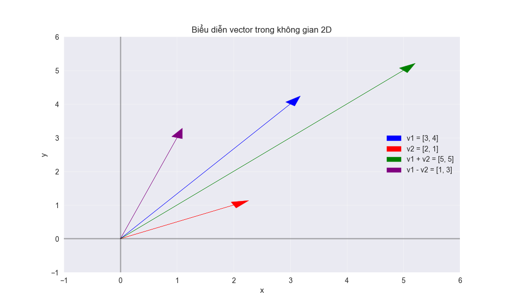
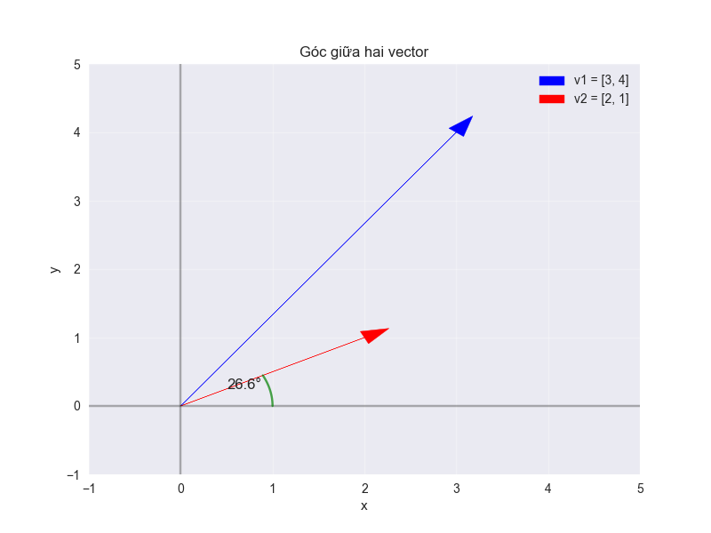
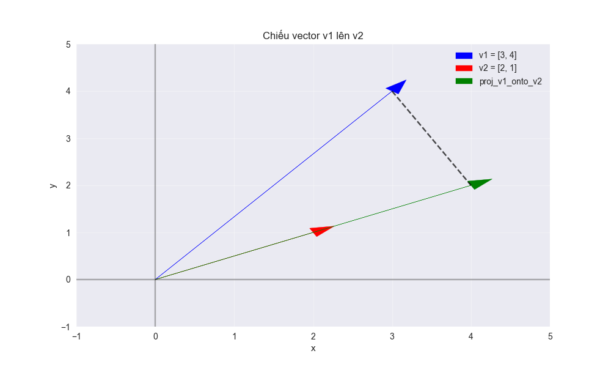
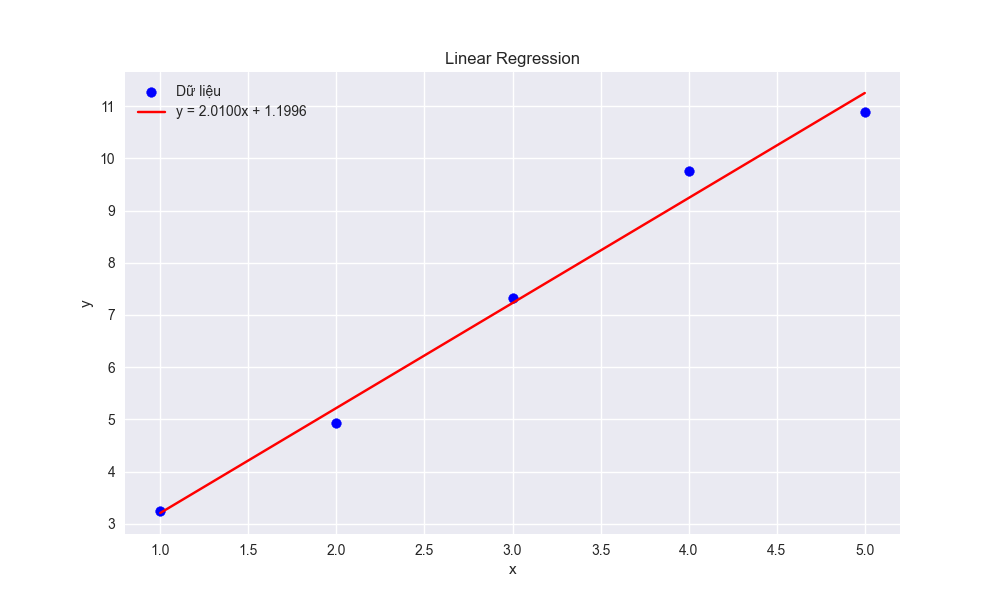
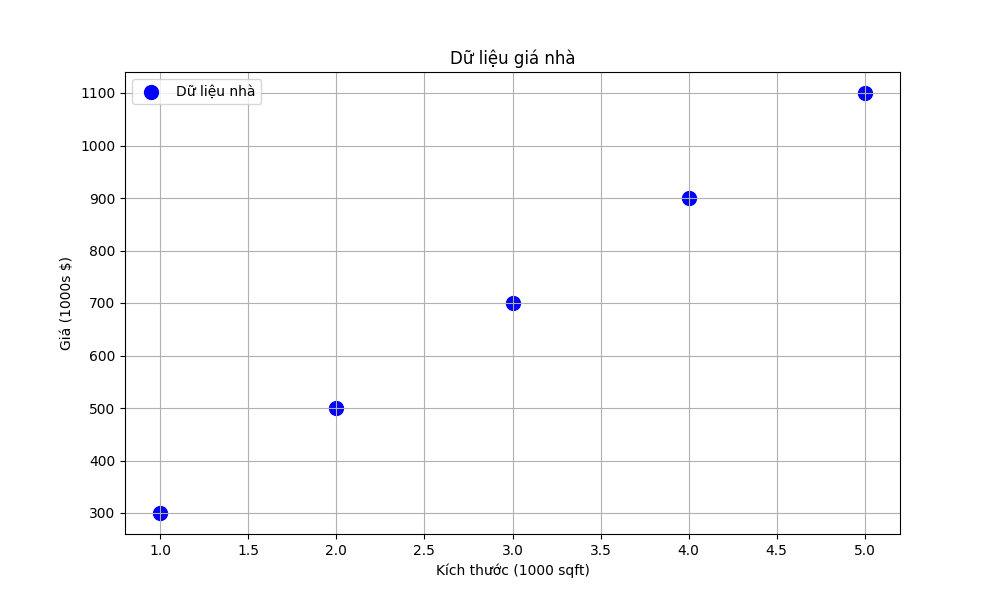
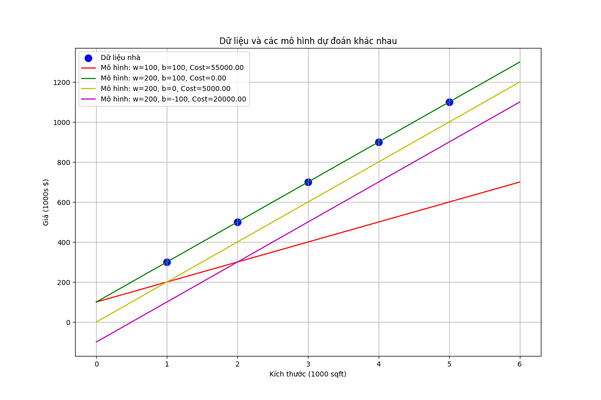
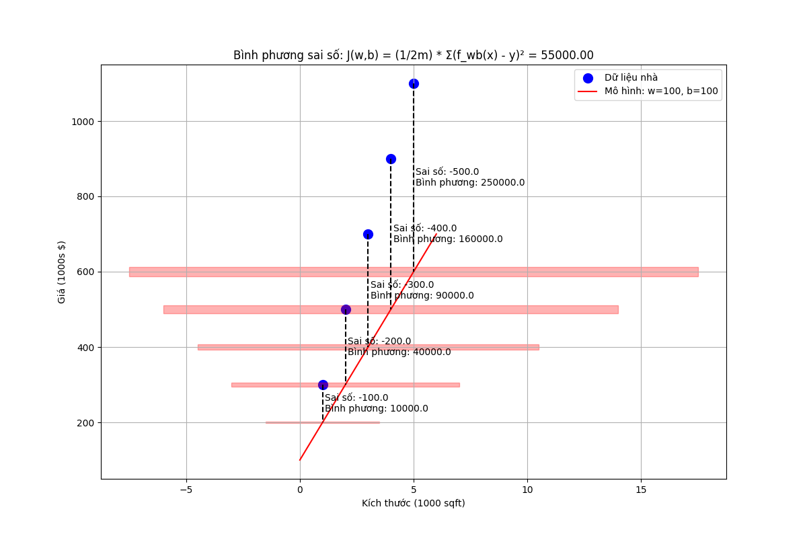
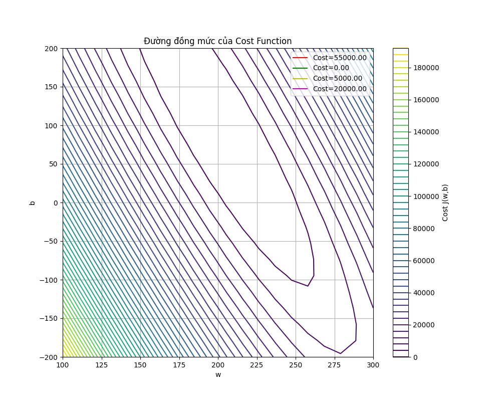

# Ứng Dụng Giải Tích và Học Máy

Bộ ví dụ minh họa về các phép toán vector và ứng dụng trong học máy.

## Cấu Trúc Dự Án

```
calculus-machine-learning/
├── README.md
├── requirements.txt
├── setup.py
├── src/
│   └── calculus_ml/
│       ├── __init__.py
│       ├── vector_operations.py
│       ├── vector_visualization.py
│       ├── linear_regression.py
│       ├── cost_calculation.py
│       ├── cost_calculation_main.py
│       └── cost_function.py
└── images/
    └── ...
```

## Tính Năng

1. **Vector cơ bản và biểu diễn trực quan**
   - Tạo và vẽ vector trong không gian 2D
   - Minh họa phép cộng và trừ vector

2. **Phép toán vector cơ bản**
   - Cộng, trừ vector
   - Nhân vector với số vô hướng
   - Tính độ dài (norm) của vector
   - Tích vô hướng (dot product)
   - Tích có hướng (cross product)

3. **Vector đơn vị và góc giữa hai vector**
   - Chuẩn hóa vector thành vector đơn vị
   - Tính góc giữa hai vector
   - Biểu diễn trực quan góc giữa vector

4. **Ứng dụng trong Linear Regression**
   - Tạo dữ liệu đơn giản
   - Sử dụng phép tính vector để tìm hệ số hồi quy
   - Vẽ đường hồi quy

5. **Chiếu vector và ứng dụng**
   - Chiếu vector lên một vector khác
   - Biểu diễn trực quan phép chiếu

6. **Tính toán Cost Function trong Học Máy**
   - Minh họa chi tiết cách tính cost function
   - So sánh các mô hình khác nhau
   - Trực quan hóa sai số và bình phương sai số
   - Vẽ đường đồng mức của cost function

## Chi Tiết Các Hàm Chính

### 1. Vector Operations (`vector_operations.py`)

```python
def add_vectors(v1, v2):
    """
    Cộng hai vector
    Ví dụ: add_vectors([1, 2], [3, 4]) -> [4, 6]
    """
    return [x + y for x, y in zip(v1, v2)]

def subtract_vectors(v1, v2):
    """
    Trừ hai vector
    Ví dụ: subtract_vectors([3, 4], [1, 2]) -> [2, 2]
    """
    return [x - y for x, y in zip(v1, v2)]

def scalar_multiply(v, scalar):
    """
    Nhân vector với số vô hướng
    Ví dụ: scalar_multiply([1, 2], 3) -> [3, 6]
    """
    return [x * scalar for x in v]

def vector_norm(v):
    """
    Tính độ dài (norm) của vector
    Ví dụ: vector_norm([3, 4]) -> 5.0
    """
    return np.sqrt(sum(x * x for x in v))

def dot_product(v1, v2):
    """
    Tính tích vô hướng của hai vector
    Ví dụ: dot_product([1, 2], [3, 4]) -> 11
    """
    return sum(x * y for x, y in zip(v1, v2))

def cross_product(v1, v2):
    """
    Tính tích có hướng của hai vector trong không gian 2D
    Ví dụ: cross_product([1, 0], [0, 1]) -> 1
    """
    return v1[0] * v2[1] - v1[1] * v2[0]

def normalize_vector(v):
    """
    Chuẩn hóa vector thành vector đơn vị
    Ví dụ: normalize_vector([3, 4]) -> [0.6, 0.8]
    """
    norm = vector_norm(v)
    return [x / norm for x in v]

def angle_between_vectors(v1, v2):
    """
    Tính góc giữa hai vector (đơn vị: độ)
    Ví dụ: angle_between_vectors([1, 0], [0, 1]) -> 90.0
    """
    dot = dot_product(v1, v2)
    norms = vector_norm(v1) * vector_norm(v2)
    return np.degrees(np.arccos(dot / norms))
```

#### Ví dụ Sử Dụng Vector Operations

```python
# Tạo các vector mẫu
v1 = [3, 4]
v2 = [1, 2]
v3 = [0, 1]

# Các phép toán cơ bản
print(f"Tổng vector: {add_vectors(v1, v2)}")  # [4, 6]
print(f"Hiệu vector: {subtract_vectors(v1, v2)}")  # [2, 2]
print(f"Nhân với số vô hướng: {scalar_multiply(v1, 2)}")  # [6, 8]

# Tính toán độ dài và góc
print(f"Độ dài vector v1: {vector_norm(v1)}")  # 5.0
print(f"Góc giữa v1 và v2: {angle_between_vectors(v1, v2)}°")  # 10.3°

# Vector đơn vị
v1_unit = normalize_vector(v1)
print(f"Vector đơn vị của v1: {v1_unit}")  # [0.6, 0.8]
```

#### Minh Họa Trực Quan

Dưới đây là các hình minh họa cho các phép toán vector:

1. **Vector Cơ Bản**

```python
v1 = [3, 4]
v2 = [1, 2]
result = add_vectors(v1, v2)  # [4, 6]
```

2. **Góc Giữa Hai Vector**

```python
v1 = [3, 4]
v2 = [1, 2]
angle = angle_between_vectors(v1, v2)  # 10.3°
```

3. **Chiếu Vector**

```python
v1 = [3, 4]
v2 = [1, 2]
projection = project_vector(v1, v2)  # Chiếu v1 lên v2
```

4. **Linear Regression với Vector**

```python
# Sử dụng vector để tìm đường hồi quy
X = np.array([1, 2, 3, 4, 5])
y = np.array([2, 4, 6, 8, 10])
w, b = find_linear_regression(X, y)
```

### 2. Cost Calculation (`cost_calculation.py`)

```python
def predict(x, w, b):
    """
    Dự đoán giá trị y dựa trên x, w, b
    y = w*x + b
    
    Ví dụ:
    x = 2.0, w = 200, b = 100
    predict(2.0, 200, 100) -> 500
    """
    return w * x + b

def compute_cost(x, y, w, b):
    """
    Tính cost function J(w,b)
    J(w,b) = (1/2m) * Σ(f(x⁽ⁱ⁾) - y⁽ⁱ⁾)²
    
    Ví dụ:
    x = [1.0, 2.0], y = [300, 500], w = 200, b = 100
    compute_cost(x, y, w, b) -> 2500
    """
    m = len(x)
    total_cost = sum((predict(x[i], w, b) - y[i]) ** 2 for i in range(m))
    return total_cost / (2 * m)
```

#### Minh Họa Trực Quan Cost Function

1. **Dữ Liệu Giá Nhà**

```python
# Dữ liệu mẫu về giá nhà
x_train = [1.0, 2.0, 3.0, 4.0, 5.0]  # kích thước (1000 sqft)
y_train = [300, 500, 700, 900, 1100]  # giá (1000s $)
```

2. **So Sánh Các Mô Hình Khác Nhau**

```python
# So sánh các mô hình với các tham số khác nhau
models = [
    (100, 100),  # w=100, b=100
    (200, 100),  # w=200, b=100
    (200, 0),    # w=200, b=0
    (200, -100)  # w=200, b=-100
]
plot_different_models(x_train, y_train, models)
```

3. **Chi Tiết Sai Số của Mô Hình**

```python
# Vẽ chi tiết sai số của mô hình
w, b = 200, 100
plot_model_errors(x_train, y_train, w, b)
```

4. **Bình Phương Sai Số**

```python
# Vẽ bình phương sai số
plot_squared_errors(x_train, y_train, w, b)
```

Hình minh họa trên cho thấy:
- Các điểm dữ liệu thực tế (màu xanh)
- Đường hồi quy (màu đỏ)
- Hình vuông màu đỏ nhạt thể hiện bình phương sai số tại mỗi điểm
- Độ lớn của hình vuông tỷ lệ với bình phương sai số
- Tổng diện tích các hình vuông (chia cho 2m) chính là giá trị của cost function

Ví dụ chi tiết:
```python
# Tính bình phương sai số cho từng điểm
for i in range(len(x_train)):
    x_i = x_train[i]
    y_i = y_train[i]
    y_pred_i = predict(x_i, w, b)
    
    # Sai số
    error = y_pred_i - y_i
    # Bình phương sai số
    squared_error = error ** 2
    
    print(f"Điểm {i+1}:")
    print(f"  Giá trị thực: {y_i}")
    print(f"  Dự đoán: {y_pred_i:.1f}")
    print(f"  Sai số: {error:.1f}")
    print(f"  Bình phương sai số: {squared_error:.1f}")
```

5. **Đường Đồng Mức của Cost Function**

```python
# Vẽ đường đồng mức của cost function
plot_cost_contour(x_train, y_train, w_range=(100, 300), b_range=(-200, 200))
```

Hình minh họa trên cho thấy:
- Trục x: giá trị của tham số w (hệ số góc)
- Trục y: giá trị của tham số b (hệ số tự do)
- Màu sắc: giá trị của cost function J(w,b)
  - Màu đỏ: giá trị cost cao (mô hình kém)
  - Màu xanh: giá trị cost thấp (mô hình tốt)
- Các đường đồng mức: nối các điểm có cùng giá trị cost
- Các điểm đánh dấu: vị trí của các mô hình đã thử nghiệm

Ví dụ chi tiết:
```python
# Tạo lưới các giá trị w và b
w_values = np.linspace(100, 300, 20)
b_values = np.linspace(-200, 200, 20)
W, B = np.meshgrid(w_values, b_values)

# Tính cost function cho mỗi cặp giá trị (w, b)
Z = np.zeros_like(W)
for i in range(len(w_values)):
    for j in range(len(b_values)):
        Z[j, i] = compute_cost(x_train, y_train, W[j, i], B[j, i])

# Tìm giá trị tối ưu
min_cost_idx = np.unravel_index(Z.argmin(), Z.shape)
w_opt = W[min_cost_idx]
b_opt = B[min_cost_idx]
min_cost = Z[min_cost_idx]

print(f"Giá trị tối ưu:")
print(f"  w = {w_opt:.1f}")
print(f"  b = {b_opt:.1f}")
print(f"  Cost = {min_cost:.1f}")
```

## Ví Dụ Sử Dụng

### 1. Minh Họa Cost Function

```python
# Tạo dữ liệu mẫu
x_train = [1.0, 2.0, 3.0, 4.0, 5.0]  # kích thước nhà (1000 sqft)
y_train = [300, 500, 700, 900, 1100]  # giá nhà (1000s $)

# Tính cost cho các mô hình khác nhau
w1, b1 = 100, 100
cost1 = compute_cost(x_train, y_train, w1, b1)
print(f"Cost với w={w1}, b={b1}: {cost1:.2f}")

# Vẽ biểu đồ so sánh các mô hình
plot_different_models(x_train, y_train, [(w1, b1), (w2, b2), (w3, b3)])
```

### 2. Trực Quan Hóa Sai Số

```python
# Vẽ chi tiết sai số của mô hình
plot_model_errors(x_train, y_train, w, b)

# Vẽ bình phương sai số
plot_squared_errors(x_train, y_train, w, b)
```

## Hướng Dẫn Cài Đặt

1. Tải mã nguồn:
```bash
git clone https://github.com/aletuan/calculus-machine-learning.git
cd calculus-machine-learning
```

2. Cài đặt các thư viện phụ thuộc:
```bash
pip install -r requirements.txt
```

3. Cài đặt gói phần mềm ở chế độ phát triển:
```bash
pip install -e .
```

## Cách Sử Dụng

Chạy chương trình chính để xem tất cả các ví dụ:
```bash
python -m calculus_ml.main
```

## Phát Triển

Để đóng góp cho dự án:

1. Fork repository này
2. Tạo nhánh mới cho tính năng của bạn
3. Thực hiện các thay đổi
4. Gửi pull request

## Giấy Phép

Dự án này được cấp phép theo giấy phép MIT - xem file LICENSE để biết thêm chi tiết.