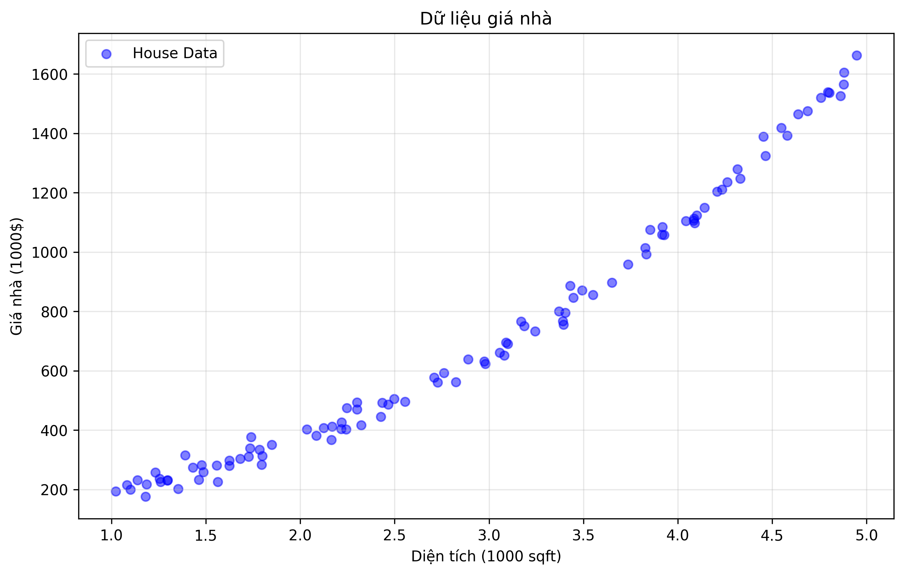
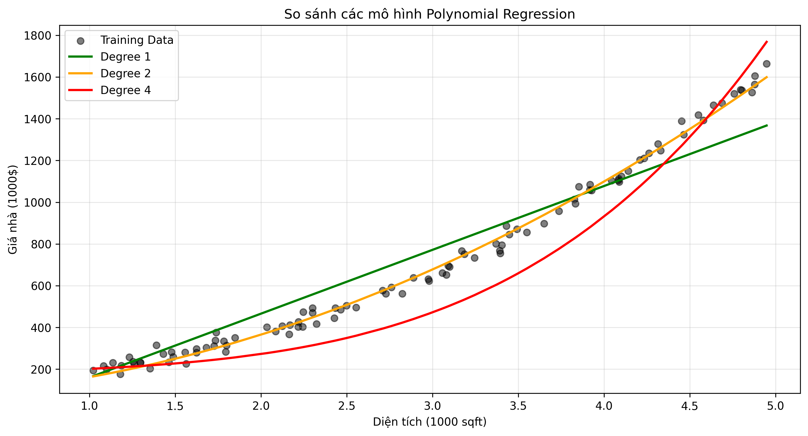
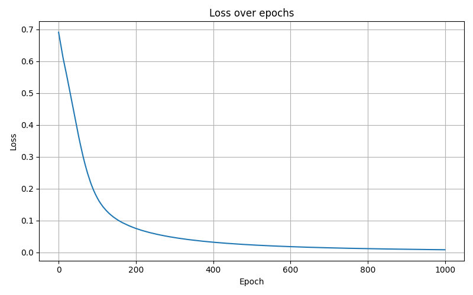

# Prediction Models in Machine Learning

Triển khai và trực quan hóa các mô hình học máy cơ bản, từ hồi quy tuyến tính đến mạng neural, với các ví dụ thực tế về dự đoán giá nhà, phân loại kết quả tuyển sinh, và học các hàm logic cơ bản.

## Giới Thiệu Khái Niệm

### Machine Learning là gì?
Machine Learning (Học máy) là một nhánh của trí tuệ nhân tạo, cho phép máy tính "học" từ dữ liệu mà không cần được lập trình một cách tường minh. Trong project này, chúng ta tập trung vào học có giám sát (supervised learning) với các dạng bài toán phổ biến:

### 1. Regression (Hồi quy)
- **Định nghĩa**: Dự đoán một giá trị liên tục dựa trên các đặc trưng đầu vào
- **Ví dụ**: Dự đoán giá nhà dựa trên diện tích và số phòng ngủ
- **Các loại hồi quy**:
  - Linear Regression (Hồi quy tuyến tính)
  - Multiple Linear Regression (Hồi quy nhiều biến)
  - Polynomial Regression (Hồi quy đa thức)
- **Đánh giá**: Sử dụng các metrics như MSE (Mean Squared Error), MAE (Mean Absolute Error)

### 2. Classification (Phân loại)
- **Định nghĩa**: Phân loại dữ liệu vào các nhóm/lớp rời rạc
- **Ví dụ**: 
  - Phân loại học sinh đỗ/trượt dựa trên điểm thi
  - Học các hàm logic (AND, XOR) với perceptron và neural network
- **Các mô hình**:
  - Logistic Regression
  - Perceptron
  - Neural Network (một lớp ẩn)
  - TensorFlow Neural Network
- **Đánh giá**: Accuracy, Precision, Recall, F1-score

### 3. Neural Networks (Mạng Neural)
- **Định nghĩa**: Mô hình học máy lấy cảm hứng từ cấu trúc não bộ
- **Ví dụ**:
  - Học hàm XOR với neural network một lớp ẩn
  - Học hàm AND với TensorFlow neural network
- **Các thành phần**:
  - Input Layer (Lớp đầu vào)
  - Hidden Layer (Lớp ẩn)
  - Output Layer (Lớp đầu ra)
  - Activation Functions (Hàm kích hoạt)
  - Backpropagation (Lan truyền ngược)

### Các Khái Niệm Quan Trọng

1. **Mô hình (Model)**
   - Hàm số toán học mô tả mối quan hệ giữa đầu vào và đầu ra
   - Được xác định bởi các tham số (parameters) cần tối ưu

2. **Đánh giá (Evaluation)**
   - **Loss Function (Hàm mất mát)**: 
     - **Định nghĩa**: Hàm số đo lường mức độ sai lệch giữa giá trị dự đoán của mô hình và giá trị thực tế
     - **Vai trò**:
       - Đóng vai trò là "la bàn" định hướng quá trình học của mô hình
       - Cung cấp một giá trị số (scalar) có thể tối ưu hóa bằng gradient descent
       - Là cầu nối giữa lý thuyết toán học và ứng dụng thực tế của mô hình
     
     - **Các loại hàm mất mát phổ biến**:
       1. **Mean Squared Error (MSE)**:
          - Công thức: MSE = (1/m) * Σ(y_pred - y_true)²
          - Phù hợp với: Linear Regression và các bài toán dự đoán giá trị liên tục
          - Đặc điểm: Phạt nặng các sai số lớn (do bình phương), nhạy cảm với outliers
       
       2. **Binary Cross-Entropy**:
          - Công thức: BCE = -(1/m) * Σ[y_true*log(y_pred) + (1-y_true)*log(1-y_pred)]
          - Phù hợp với: Logistic Regression và các bài toán phân loại nhị phân
          - Đặc điểm: Đánh giá tốt xác suất dự đoán, phù hợp với dữ liệu nhãn 0/1
       
       3. **Categorical Cross-Entropy**:
          - Phù hợp với: Bài toán phân loại nhiều lớp
          - Mở rộng của Binary Cross-Entropy cho nhiều lớp
       
       4. **Hinge Loss**:
          - Sử dụng cho: Support Vector Machines
          - Tối ưu hóa biên phân loại (margin)
     
     - **Lựa chọn hàm mất mát**:
       - Phụ thuộc vào bản chất của bài toán (hồi quy/phân loại)
       - Phụ thuộc vào phân phối của dữ liệu
       - Ảnh hưởng trực tiếp đến quá trình học và kết quả cuối cùng của mô hình
   
   - **Training**: Quá trình tối ưu mô hình trên tập dữ liệu huấn luyện
   - **Convergence**: Sự hội tụ của quá trình học, thể hiện qua đồ thị loss function

3. **Học (Learning)**
   - **Gradient Descent**: Thuật toán tối ưu tham số quan trọng nhất trong học máy
     - **Gradient là gì?**
       - Gradient là vector chứa các đạo hàm riêng của hàm mất mát theo từng tham số
       - Gradient chỉ ra hướng tăng nhanh nhất của hàm mất mát tại một điểm
       - Ví dụ: Với hàm mất mát J(w,b), gradient là [∂J/∂w, ∂J/∂b]
     
     - **Tại sao đi ngược hướng gradient?**
       - Mục tiêu: Tìm tham số để hàm mất mát đạt giá trị nhỏ nhất
       - Gradient chỉ hướng tăng nhanh nhất → Ngược gradient là hướng giảm nhanh nhất
       - Giống như đi xuống đồi: luôn chọn hướng dốc nhất để xuống nhanh nhất
     
     - **Quá trình cập nhật tham số**:
       1. Tính gradient tại vị trí hiện tại
       2. Cập nhật tham số: θ_new = θ_old - α * gradient
          - α (learning rate): điều chỉnh độ lớn của bước di chuyển
          - Nếu α quá lớn: có thể vượt qua điểm tối ưu
          - Nếu α quá nhỏ: hội tụ chậm
     
     - **Ví dụ trực quan**:
       
       - **Đồ thị minh họa**:
         - Đường cong xanh: Hàm mất mát (Loss function)
         - Điểm đỏ: Vị trí hiện tại của tham số
         - Đường đứt nét đỏ: Gradient (độ dốc) tại điểm hiện tại
         - Mũi tên xanh lá: Hướng cập nhật tham số (ngược với gradient)
       
       - **Giải thích**:
         - Gradient dương (độ dốc đi lên) → Di chuyển sang trái (giảm tham số)
         - Gradient âm (độ dốc đi xuống) → Di chuyển sang phải (tăng tham số)
         - Quá trình lặp lại cho đến khi đạt điểm có gradient ≈ 0 (điểm tối ưu)

   - **Learning Rate**: Tốc độ học, quyết định độ lớn của bước cập nhật trong gradient descent
   - **Iteration**: Số lần lặp lại quá trình học

### Các Công Cụ Sử Dụng
- **NumPy**: Thư viện tính toán số học
- **Matplotlib**: Thư viện vẽ đồ thị
- **Rich**: Thư viện định dạng output trong terminal

## Cấu Trúc Dự Án

```
src/calculus_ml/
├── core/                    # Core functionality
│   ├── linear/             # Linear regression implementation
│   │   └── regression.py   # Linear regression class
│   ├── logistic/           # Logistic regression implementation
│   │   └── regression.py   # Logistic regression class
│   └── base/               # Base classes and utilities
│       └── scaler.py       # Feature scaling utilities
│
├── examples/               # Example implementations
│   ├── linear_regression/  # Linear regression examples
│   │   ├── single_linear_example.py    # Simple linear regression
│   │   └── multiple_linear_example.py  # Multiple linear regression
│   ├── polynomial_example.py           # Polynomial regression
│   ├── logistic_example.py             # Logistic regression
│   ├── perceptron/         # Perceptron implementation
│   │   ├── perceptron.py   # Perceptron class
│   │   └── train.py        # Training script
│   ├── single_hidden_layer/ # Single hidden layer neural network
│   │   ├── model_numpy.py  # Neural network implementation
│   │   ├── activations.py  # Activation functions
│   │   └── train.py        # Training script
│   ├── single_hidden_layer/ # Single hidden layer neural network
│   │   ├── model_numpy.py  # Neural network implementation
│   │   ├── activations.py  # Activation functions
│   │   └── train.py        # Training script
│   └── tf_one_hidden_layer/ # TensorFlow neural network
│       ├── model_tf.py     # TensorFlow model implementation
│       ├── dataset.py      # Dataset generation and handling
│       ├── train.py        # Training script
│       └── predict.py      # Prediction script
│
├── visualization/          # Visualization utilities
│   └── base/
│       ├── plot_utils.py   # Plotting utilities
│       └── gradient_example.py  # Gradient descent visualization
│
└── main.py                # Main entry point

images/                    # Generated visualization images
├── linear_regression_fit.png        # Linear regression fit
├── linear_cost_history.png         # Linear regression cost history
├── multiple_regression_fit.png     # Multiple regression fit
├── multiple_cost_history.png       # Multiple regression cost history
├── gradient_descent_example.png    # Gradient descent visualization
├── polynomial_regression_fit.png   # Polynomial regression fit
├── regularization_effect.png       # Regularization effect
├── logistic_decision_boundary.png  # Logistic regression decision boundary
├── logistic_cost_history.png       # Logistic regression cost history
├── perceptron_training_history.png # Perceptron training history
├── neural_network_training_history.png # Neural network training history
└── tf_and_training.png             # TensorFlow neural network training history
```

## Ví Dụ Minh Họa

### 1. Linear Regression (Hồi quy tuyến tính)

#### 1.1. Hồi quy tuyến tính đơn giản - Dự Đoán Giá Nhà

##### Mô tả bài toán
- **Mục tiêu**: Dự đoán giá nhà dựa trên diện tích
- **Dữ liệu**: 
  - 100 mẫu nhà với diện tích và giá
  - Biến đầu vào (x): Diện tích (1000 sqft), phân phối chuẩn quanh 2.5 (1-5)
  - Biến đầu ra (y): Giá nhà (1000$), tương quan tuyến tính với diện tích

##### Công thức toán học
- **Mô hình dự đoán**: y = wx + b
  - w: hệ số ảnh hưởng của diện tích đến giá
  - b: giá cơ bản của nhà
- **Hàm mất mát**: J(w,b) = (1/2m) * Σ(f(x⁽ⁱ⁾) - y⁽ⁱ⁾)²
- **Gradient descent**: 
  - ∂J/∂w = (1/m) * Σ(f(x⁽ⁱ⁾) - y⁽ⁱ⁾) * x⁽ⁱ⁾
  - ∂J/∂b = (1/m) * Σ(f(x⁽ⁱ⁾) - y⁽ⁱ⁾)

##### Trực quan hóa kết quả

- **Đồ thị dự đoán**:
  - Điểm xanh: dữ liệu thực tế (diện tích, giá)
  - Đường đỏ: mô hình dự đoán tối ưu
  - Trục x: Diện tích nhà (1000 sqft)
  - Trục y: Giá nhà (1000$)


- **Đồ thị huấn luyện**:
  - Trục x: Số vòng lặp
  - Trục y: Giá trị hàm mất mát
  - Đường cong giảm thể hiện mô hình đang học tốt

#### 1.2. Hồi quy tuyến tính nhiều biến - Dự Đoán Giá Nhà

##### Mô tả bài toán
- **Mục tiêu**: Dự đoán giá nhà dựa trên diện tích và số phòng ngủ
- **Dữ liệu**: 
  - 100 mẫu nhà với diện tích, số phòng ngủ và giá
  - Biến đầu vào:
    - x₁: Diện tích (1000 sqft)
    - x₂: Số phòng ngủ (1-5)
  - Biến đầu ra (y): Giá nhà (1000$)
- **Xử lý dữ liệu**:
  - Sử dụng StandardScaler để chuẩn hóa dữ liệu đầu vào
  - Công thức chuẩn hóa: x' = (x - μ) / σ
  - Mục đích: Cải thiện tốc độ hội tụ của gradient descent
  - Kết quả chuẩn hóa:
    - Diện tích: min=-2.78, max=2.16, mean=0.00
    - Số phòng ngủ: min=-1.26, max=1.74, mean=-0.00

##### Công thức toán học
- **Mô hình dự đoán**: y = w₁x₁ + w₂x₂ + b
  - w₁: hệ số ảnh hưởng của diện tích đến giá
  - w₂: hệ số ảnh hưởng của số phòng ngủ đến giá
  - b: giá cơ bản của nhà
- **Hàm mất mát**: J(w₁,w₂,b) = (1/2m) * Σ(h(x⁽ⁱ⁾) - y⁽ⁱ⁾)²
- **Gradient descent**: 
  - ∂J/∂w₁ = (1/m) * Σ(h(x⁽ⁱ⁾) - y⁽ⁱ⁾) * x₁⁽ⁱ⁾
  - ∂J/∂w₂ = (1/m) * Σ(h(x⁽ⁱ⁾) - y⁽ⁱ⁾) * x₂⁽ⁱ⁾
  - ∂J/∂b = (1/m) * Σ(h(x⁽ⁱ⁾) - y⁽ⁱ⁾)

##### Trực quan hóa kết quả

- **Đồ thị dự đoán**:
  - Điểm xanh: dữ liệu thực tế (diện tích, số phòng ngủ, giá)
  - Mặt phẳng đỏ: mô hình dự đoán tối ưu
  - Trục x: Diện tích nhà (1000 sqft)
  - Trục y: Số phòng ngủ
  - Trục z: Giá nhà (1000$)


- **Đồ thị huấn luyện**:
  - Trục x: Số vòng lặp
  - Trục y: Giá trị hàm mất mát
  - Đường cong giảm thể hiện mô hình đang học tốt

#### 1.3. Polynomial Regression với Regularization - Dự đoán giá nhà nâng cao

##### Mô tả bài toán
- **Mục tiêu**: Dự đoán giá nhà với mô hình phi tuyến, tránh overfitting
- **Dữ liệu**: 
  - Tương tự bài toán linear regression đơn giản
  - Thêm các đặc trưng phi tuyến: x², x³, x⁴
  - **Mô tả chi tiết**: Dữ liệu được tạo ra để mô phỏng mối quan hệ phi tuyến giữa diện tích nhà và giá nhà.
    - Diện tích nhà (trục x) được biểu diễn trong đơn vị 1000 sqft.
    - Giá nhà (trục y) được biểu diễn trong đơn vị 100k$.
    - Dữ liệu được tạo ra với sự biến động cục bộ và nhiễu để phản ánh thực tế thị trường.
    
  

- **Thách thức**: 
  - Overfitting với polynomial bậc cao
  - Cân bằng giữa fit data và model complexity

##### Công thức toán học
- **Mô hình dự đoán**: 
  ```
  f(x) = w₁x + w₂x² + w₃x³ + w₄x⁴ + b
  ```
  - wᵢ: Hệ số cho đặc trưng bậc i
  - b: Độ chệch (bias)

- **Hàm mất mát với regularization**: 
  ```
  J(w,b) = (1/2m) * [Σ(f(x⁽ⁱ⁾) - y⁽ⁱ⁾)² + λ * Σwⱼ²]
  ```
  - Phần 1: Mean squared error (fit data)
  - Phần 2: Regularization term (keep wⱼ small)
  - λ: Hệ số regularization
    - λ = 0: Không có regularization, có thể overfitting
    - λ lớn: Model đơn giản hơn, có thể underfitting
    - λ tối ưu: Cân bằng giữa model complexity và fit data

- **Gradient descent với regularization**: 
  ```
  ∂J/∂wⱼ = (1/m) * [Σ(f(x⁽ⁱ⁾) - y⁽ⁱ⁾) * xⱼ⁽ⁱ⁾ + λ * wⱼ]
  ∂J/∂b = (1/m) * Σ(f(x⁽ⁱ⁾) - y⁽ⁱ⁾)
  ```
  - Thêm thành phần λ * wⱼ vào gradient của wⱼ
  - Gradient của b không thay đổi (không regularize bias)

##### Trực quan hóa kết quả

- **Đồ thị so sánh các mô hình**:
  - Đường màu xanh lá: Linear regression (bậc 1)
  - Đường màu vàng: Polynomial bậc 2
  - Đường màu đỏ: Polynomial bậc 4
  - Điểm đen: Dữ liệu thực tế
  - Trục x: Diện tích nhà (1000 sqft)
  - Trục y: Giá nhà (1000$)


- **Đồ thị ảnh hưởng của regularization**:
  - Đường màu xanh: λ nhỏ (overfitting)
  - Đường màu vàng: λ tối ưu (balanced)
  - Đường màu đỏ: λ lớn (underfitting)
  - Vùng xám: Độ tin cậy của dự đoán

##### Ý nghĩa thực tiễn
- **Lợi ích của polynomial features**:
  - Mô hình hóa được mối quan hệ phi tuyến
  - Nắm bắt được các pattern phức tạp trong dữ liệu
  - Tăng độ chính xác của dự đoán

- **Vai trò của regularization**:
  - Giảm thiểu overfitting
  - Tăng khả năng tổng quát hóa của mô hình
  - Tự động chọn mức độ phức tạp phù hợp

- **Hướng dẫn chọn hyperparameters**:
  - Bậc của polynomial: Thử nghiệm từ 2-5
  - Hệ số λ: Grid search với cross-validation
  - Theo dõi train/validation error để tránh overfitting

### 2. Logistic Regression - Dự Đoán Kết Quả Tuyển Sinh

#### Mô tả bài toán
- **Mục tiêu**: Dự đoán kết quả tuyển sinh (Đỗ/Trượt) dựa trên điểm thi và GPA
- **Dữ liệu**:
  - 100 hồ sơ tuyển sinh
  - Biến đầu vào:
    - x₁: Điểm thi (0-100), phân phối chuẩn quanh 65
    - x₂: GPA (0-4), phân phối chuẩn quanh 3.0
  - Biến đầu ra: Kết quả (1: Đỗ, 0: Trượt)

#### Công thức toán học
- **Hàm sigmoid**: g(z) = 1 / (1 + e^(-z))
- **Mô hình dự đoán**: P(đỗ) = g(w₁x₁ + w₂x₂ + b)
  - w₁: trọng số của điểm thi
  - w₂: trọng số của GPA
  - b: độ chệch
- **Binary cross-entropy loss**:
``` 
  J(w₁,w₂,b) = -(1/m) * Σ[y⁽ⁱ⁾log(h(x⁽ⁱ⁾)) + (1-y⁽ⁱ⁾)log(1-h(x⁽ⁱ⁾))]
```
- **Gradient descent**:
  - ∂J/∂w₁ = (1/m) * Σ(h(x⁽ⁱ⁾) - y⁽ⁱ⁾) * x₁⁽ⁱ⁾
  - ∂J/∂w₂ = (1/m) * Σ(h(x⁽ⁱ⁾) - y⁽ⁱ⁾) * x₂⁽ⁱ⁾
  - ∂J/∂b = (1/m) * Σ(h(x⁽ⁱ⁾) - y⁽ⁱ⁾)

#### Trực quan hóa kết quả

- **Đồ thị phân loại**:
  - Điểm xanh dương: Sinh viên đỗ
  - Điểm đỏ: Sinh viên trượt
  - Đường xanh lá: Decision boundary (P(đỗ) = 0.5)
  - Vùng màu: Xác suất đỗ (từ 0 đến 1)
  - Trục x: Điểm thi
  - Trục y: GPA


- **Đồ thị huấn luyện**:
  - Trục x: Số vòng lặp
  - Trục y: Giá trị hàm mất mát
  - Đường cong giảm thể hiện mô hình đang học tốt

### 4. Neural Networks - Từ Perceptron Đơn Giản Đến Mạng Neural

Neural Networks (Mạng Neural) là một trong những mô hình học máy mạnh mẽ nhất, lấy cảm hứng từ cấu trúc và cách hoạt động của não bộ con người. Trong project này, chúng ta sẽ khám phá sự phát triển từ mô hình đơn giản nhất (perceptron) đến mạng neural với một lớp ẩn, thông qua các ví dụ học các hàm logic cơ bản.

#### 4.1. Perceptron - Mô Hình Neural Đơn Giản Nhất

##### Mô tả bài toán
- **Mục tiêu**: Huấn luyện perceptron học hàm logic AND
- **Dữ liệu**:
  - Đầu vào: Các cặp giá trị nhị phân (0,0), (0,1), (1,0), (1,1)
  - Đầu ra: Kết quả của phép AND (0, 0, 0, 1)
- **Đặc điểm**:
  - Là mô hình neural network đơn giản nhất
  - Chỉ có một lớp đầu vào và một nơ-ron đầu ra
  - Sử dụng hàm kích hoạt sigmoid để tạo đầu ra liên tục

##### Công thức toán học
- **Mô hình dự đoán**:
  ```
  z = w₁x₁ + w₂x₂ + b
  y_hat = σ(z) = 1 / (1 + e^(-z))
  ```
  - w₁, w₂: trọng số (weights)
  - b: độ chệch (bias)
  - σ: hàm sigmoid

- **Hàm mất mát**:
  ```
  L(y, y_hat) = -(y * log(y_hat) + (1-y) * log(1-y_hat))
  ```
  - Binary Cross-Entropy Loss
  - Phù hợp với bài toán phân loại nhị phân

- **Gradient descent**:
  ```
  w₁ = w₁ - α * (y_hat - y) * x₁
  w₂ = w₂ - α * (y_hat - y) * x₂
  b = b - α * (y_hat - y)
  ```
  - α: learning rate
  - (y_hat - y): sai số dự đoán

##### Trực quan hóa kết quả

- **Đồ thị huấn luyện**:
  - Trục x: Số vòng lặp
  - Trục y: Giá trị hàm mất mát
  - Đường cong giảm thể hiện perceptron đang học tốt

#### 4.2. Single Hidden Layer Neural Network - Vượt Qua Giới Hạn Của Perceptron

##### Mô tả bài toán
- **Mục tiêu**: Huấn luyện mạng neural với một lớp ẩn để giải quyết bài toán XOR
- **Dữ liệu**:
  - Đầu vào: Các cặp giá trị nhị phân (0,0), (0,1), (1,0), (1,1)
  - Đầu ra: Kết quả của phép XOR (0, 1, 1, 0)
- **Đặc điểm**:
  - Bài toán không thể giải quyết bằng perceptron đơn giản
  - Cần ít nhất một lớp ẩn để học mối quan hệ phi tuyến
  - Minh họa sức mạnh của neural network so với perceptron

##### Công thức toán học
- **Lan truyền tiến (Forward propagation)**:
  ```
  Z1 = X·W1 + b1
  A1 = σ(Z1)
  Z2 = A1·W2 + b2
  A2 = σ(Z2)
  ```
  - W1, W2: ma trận trọng số
  - b1, b2: vector độ chệch
  - σ: hàm sigmoid

- **Lan truyền ngược (Backward propagation)**:
  ```
  dZ2 = A2 - Y
  dW2 = A1ᵀ·dZ2
  db2 = sum(dZ2)
  dZ1 = dZ2·W2ᵀ * σ'(Z1)
  dW1 = Xᵀ·dZ1
  db1 = sum(dZ1)
  ```
  - Tính gradient cho từng tham số
  - Sử dụng chain rule để lan truyền sai số ngược

- **Cập nhật tham số**:
  ```
  W2 = W2 - α·dW2
  b2 = b2 - α·db2
  W1 = W1 - α·dW1
  b1 = b1 - α·db1
  ```
  - α: learning rate
  - Cập nhật theo hướng ngược gradient

##### Trực quan hóa kết quả

- **Đồ thị huấn luyện**:
  - Trục x: Số vòng lặp
  - Trục y: Giá trị hàm mất mát
  - Đường cong giảm thể hiện mạng neural đang học tốt
  - So sánh với perceptron cho thấy khả năng học mối quan hệ phi tuyến

#### 4.3. TensorFlow Neural Network - Học Hàm AND với Framework Hiện Đại

##### Mô tả bài toán
- **Mục tiêu**: Huấn luyện mạng neural với TensorFlow để học hàm logic AND
- **Dữ liệu**:
  - Đầu vào: Các cặp giá trị nhị phân (0,0), (0,1), (1,0), (1,1)
  - Đầu ra: Kết quả của phép AND (0, 0, 0, 1)
- **Đặc điểm**:
  - Sử dụng TensorFlow - framework deep learning hiện đại
  - Kiến trúc mạng: Input layer (2 nơ-ron) → Hidden layer (4 nơ-ron) → Output layer (1 nơ-ron)
  - Tận dụng các tính năng của TensorFlow:
    - Automatic differentiation
    - Optimized tensor operations
    - GPU acceleration (nếu có)

##### Công thức toán học
- **Kiến trúc mạng**:
  ```
  Input Layer (2) → Hidden Layer (4) → Output Layer (1)
  ```
  - Input Layer: 2 nơ-ron (x₁, x₂)
  - Hidden Layer: 4 nơ-ron với hàm kích hoạt ReLU
  - Output Layer: 1 nơ-ron với hàm kích hoạt sigmoid

- **Hàm mất mát**:
  ```
  L(y, y_hat) = BinaryCrossentropy(y, y_hat)
  ```
  - Binary Cross-Entropy Loss
  - Phù hợp với bài toán phân loại nhị phân

- **Tối ưu hóa**:
  ```
  optimizer = Adam(learning_rate=0.01)
  ```
  - Sử dụng Adam optimizer
  - Learning rate = 0.01
  - Adaptive learning rate cho từng tham số

##### Trực quan hóa kết quả

- **Đồ thị huấn luyện**:
  - Trục x: Số vòng lặp
  - Trục y: Giá trị hàm mất mát
  - Đường cong giảm thể hiện mạng neural đang học tốt
  - Hội tụ nhanh hơn so với cài đặt từ đầu

##### So sánh với các phương pháp khác
- **Ưu điểm của TensorFlow**:
  - Tự động tính gradient (automatic differentiation)
  - Tối ưu hóa hiệu suất tính toán
  - Dễ dàng mở rộng cho các bài toán phức tạp hơn
  - Hỗ trợ GPU acceleration
  - Có sẵn nhiều layer và optimizer

- **Kết quả**:
  - Đạt độ chính xác 100% trên tập test
  - Hội tụ nhanh hơn so với cài đặt từ đầu
  - Dễ dàng mở rộng cho các bài toán phức tạp hơn

### 5. Decision Tree - Cây Quyết Định với Information Gain

#### Mô tả bài toán
- **Mục tiêu**: Phân loại hoa Iris dựa trên các đặc trưng
- **Dữ liệu**: 
  - Tập dữ liệu Iris (2 class đầu tiên)
  - Đặc trưng: Chiều dài đài hoa, Chiều rộng đài hoa
  - Nhãn: Loại hoa (0 hoặc 1)

#### Công thức toán học
- **Entropy**: Đo độ không chắc chắn của tập dữ liệu
  ```
  H(S) = -Σ p(x) * log2(p(x))
  ```
  - S: tập dữ liệu
  - p(x): xác suất của class x

- **Information Gain**: Đo lượng thông tin thu được khi split
  ```
  IG(S,A) = H(S) - Σ |Sv|/|S| * H(Sv)
  ```
  - S: tập dữ liệu gốc
  - A: thuộc tính split
  - Sv: tập con sau khi split
  - |Sv|/|S|: tỷ lệ số mẫu trong tập con

#### Trực quan hóa kết quả

- **Đồ thị decision boundary**:
  - Trái: Kết quả trên tập train
  - Phải: Dự đoán trên tập test
  - Màu sắc: Vùng quyết định cho mỗi class
  - Điểm: Dữ liệu thực tế

## Chi Tiết Triển Khai

### Các Module Chính

1. **Core Module**: Cài đặt các thuật toán

```python
# Phần 1: StandardScaler - Chuẩn hóa dữ liệu
class StandardScaler:
    """Chuẩn hóa dữ liệu bằng phương pháp Standard Scaling"""
    def fit(self, X):
        """Tính mean và std từ dữ liệu training"""
        self.mean = np.mean(X, axis=0)
        self.std = np.std(X, axis=0)
        return self
    
    def transform(self, X):
        """Chuẩn hóa dữ liệu"""
        return (X - self.mean) / self.std
    
    def fit_transform(self, X):
        """Fit và transform dữ liệu"""
        return self.fit(X).transform(X)
    
    def inverse_transform(self, X_scaled):
        """Chuyển dữ liệu đã chuẩn hóa về dạng gốc"""
        return X_scaled * self.std + self.mean
```
→ **Vai trò**: Class này thực hiện chuẩn hóa dữ liệu bằng cách trừ mean và chia cho độ lệch chuẩn. Giúp các thuật toán học máy hoạt động hiệu quả hơn bằng cách đưa các features về cùng một scale.

```python
# Phần 2: RegressionModel - Lớp cơ sở cho các mô hình hồi quy
class RegressionModel:
    """Lớp cơ sở cho các mô hình hồi quy"""
    def __init__(self, learning_rate=0.01, num_iterations=1000):
        self.learning_rate = learning_rate
        self.num_iterations = num_iterations
        self.weights = None
        self.bias = None
        self.cost_history = []
    
    def fit(self, X, y):
        """Huấn luyện mô hình bằng gradient descent"""
        m, n = X.shape
        self.weights = np.zeros(n)
        self.bias = 0
        
        for _ in range(self.num_iterations):
            dw, db = self.compute_gradient(X, y)
            self.weights -= self.learning_rate * dw
            self.bias -= self.learning_rate * db
            self.cost_history.append(self.compute_cost(X, y))
```
→ **Vai trò**: Lớp cơ sở định nghĩa cấu trúc chung cho tất cả các mô hình hồi quy. Cung cấp phương thức `fit` để huấn luyện mô hình bằng gradient descent và lưu lại lịch sử training.

```python
# Phần 3: LinearRegression - Mô hình hồi quy tuyến tính
class LinearRegression(RegressionModel):
    """Mô hình hồi quy tuyến tính: y = wx + b"""
    def predict(self, X):
        return np.dot(X, self.weights) + self.bias
    
    def compute_cost(self, X, y):
        m = len(y)
        predictions = self.predict(X)
        return (1/(2*m)) * np.sum((predictions - y)**2)
    
    def compute_gradient(self, X, y):
        m = len(y)
        predictions = self.predict(X)
        dw = (1/m) * np.dot(X.T, (predictions - y))
        db = (1/m) * np.sum(predictions - y)
        return dw, db
```
→ **Vai trò**: Cài đặt mô hình hồi quy tuyến tính với hàm dự đoán y = wx + b. Sử dụng MSE làm hàm mất mát và tính gradient tương ứng để cập nhật tham số.

```python
# Phần 4: PolynomialRegression - Mô hình hồi quy đa thức với regularization
class PolynomialRegression(RegressionModel):
    """Mô hình hồi quy đa thức với regularization"""
    def __init__(self, degree=2, lambda_reg=0.0, learning_rate=0.01, num_iterations=1000):
        super().__init__(learning_rate, num_iterations)
        self.degree = degree
        self.lambda_reg = lambda_reg
    
    def _generate_polynomial_features(self, X):
        """Tạo các đặc trưng đa thức"""
        if X.ndim == 1:
            X = X.reshape(-1, 1)
        n_samples, n_features = X.shape
        X_poly = np.ones((n_samples, 1))
        
        # Scale X để tránh overflow
        X_scaled = X / np.max(np.abs(X))
        
        for d in range(1, self.degree + 1):
            X_poly = np.column_stack((X_poly, X_scaled ** d))
            
        return X_poly[:, 1:]  # Bỏ hằng số
```
→ **Vai trò**: Mở rộng mô hình tuyến tính để học các mối quan hệ phi tuyến. Tự động tạo các đặc trưng bậc cao (x², x³, ...) và có thêm regularization để tránh overfitting.

```python
# Phần 5: LogisticRegression - Mô hình phân loại nhị phân
class LogisticRegression(RegressionModel):
    """Mô hình phân loại nhị phân: P(y=1) = g(w₁x₁ + w₂x₂ + b)"""
    def predict(self, X):
        z = np.dot(X, self.weights) + self.bias
        return 1 / (1 + np.exp(-z))
    
    def compute_cost(self, X, y):
        m = len(y)
        predictions = self.predict(X)
        return -(1/m) * np.sum(y*np.log(predictions) + (1-y)*np.log(1-predictions))
    
    def compute_gradient(self, X, y):
        m = len(y)
        predictions = self.predict(X)
        dw = (1/m) * np.dot(X.T, (predictions - y))
        db = (1/m) * np.sum(predictions - y)
        return dw, db
```
→ **Vai trò**: Cài đặt mô hình phân loại nhị phân, sử dụng hàm sigmoid để chuyển đầu ra về khoảng [0,1] và binary cross-entropy làm hàm mất mát. Phù hợp cho các bài toán phân loại 2 lớp.

```python
# Phần 6: Perceptron - Mô hình neural đơn giản nhất
class Perceptron:
    """Mô hình perceptron đơn giản"""
    def __init__(self, learning_rate=0.01, num_iterations=1000):
        self.learning_rate = learning_rate
        self.num_iterations = num_iterations
        self.weights = None
        self.bias = None
        self.cost_history = []
    
    def predict(self, X):
        """Dự đoán đầu ra với hàm sigmoid"""
        z = np.dot(X, self.weights) + self.bias
        return 1 / (1 + np.exp(-z))
    
    def compute_cost(self, X, y):
        """Tính binary cross-entropy loss"""
        m = len(y)
        predictions = self.predict(X)
        return -(1/m) * np.sum(y*np.log(predictions) + (1-y)*np.log(1-predictions))
    
    def fit(self, X, y):
        """Huấn luyện perceptron"""
        m, n = X.shape
        self.weights = np.zeros(n)
        self.bias = 0
        
        for _ in range(self.num_iterations):
            predictions = self.predict(X)
            dw = (1/m) * np.dot(X.T, (predictions - y))
            db = (1/m) * np.sum(predictions - y)
            
            self.weights -= self.learning_rate * dw
            self.bias -= self.learning_rate * db
            self.cost_history.append(self.compute_cost(X, y))
```
→ **Vai trò**: Cài đặt mô hình perceptron đơn giản nhất, là nền tảng cho các mạng neural phức tạp hơn. Sử dụng hàm sigmoid và binary cross-entropy loss.

```python
# Phần 7: SingleHiddenLayer - Mạng neural một lớp ẩn
class SingleHiddenLayer:
    """Mạng neural với một lớp ẩn"""
    def __init__(self, hidden_size=4, learning_rate=0.01, num_iterations=1000):
        self.hidden_size = hidden_size
        self.learning_rate = learning_rate
        self.num_iterations = num_iterations
        self.W1 = None  # Weights cho lớp ẩn
        self.b1 = None  # Bias cho lớp ẩn
        self.W2 = None  # Weights cho lớp đầu ra
        self.b2 = None  # Bias cho lớp đầu ra
        self.cost_history = []
    
    def _sigmoid(self, z):
        """Hàm kích hoạt sigmoid"""
        return 1 / (1 + np.exp(-z))
    
    def _sigmoid_derivative(self, z):
        """Đạo hàm của hàm sigmoid"""
        s = self._sigmoid(z)
        return s * (1 - s)
    
    def forward_propagation(self, X):
        """Lan truyền tiến"""
        Z1 = np.dot(X, self.W1) + self.b1
        A1 = self._sigmoid(Z1)
        Z2 = np.dot(A1, self.W2) + self.b2
        A2 = self._sigmoid(Z2)
        return Z1, A1, Z2, A2
    
    def backward_propagation(self, X, y, Z1, A1, Z2, A2):
        """Lan truyền ngược"""
        m = len(y)
        
        # Tính gradient cho lớp đầu ra
        dZ2 = A2 - y
        dW2 = (1/m) * np.dot(A1.T, dZ2)
        db2 = (1/m) * np.sum(dZ2, axis=0)
        
        # Tính gradient cho lớp ẩn
        dZ1 = np.dot(dZ2, self.W2.T) * self._sigmoid_derivative(Z1)
        dW1 = (1/m) * np.dot(X.T, dZ1)
        db1 = (1/m) * np.sum(dZ1, axis=0)
        
        return dW1, db1, dW2, db2
    
    def fit(self, X, y):
        """Huấn luyện mạng neural"""
        m, n = X.shape
        self.W1 = np.random.randn(n, self.hidden_size) * 0.01
        self.b1 = np.zeros((1, self.hidden_size))
        self.W2 = np.random.randn(self.hidden_size, 1) * 0.01
        self.b2 = np.zeros((1, 1))
        
        for _ in range(self.num_iterations):
            Z1, A1, Z2, A2 = self.forward_propagation(X)
            dW1, db1, dW2, db2 = self.backward_propagation(X, y, Z1, A1, Z2, A2)
            
            self.W1 -= self.learning_rate * dW1
            self.b1 -= self.learning_rate * db1
            self.W2 -= self.learning_rate * dW2
            self.b2 -= self.learning_rate * db2
            
            self.cost_history.append(self.compute_cost(X, y))
```
→ **Vai trò**: Cài đặt mạng neural với một lớp ẩn, có khả năng học các mối quan hệ phi tuyến phức tạp. Sử dụng backpropagation để tính gradient và cập nhật tham số.

```python
# Phần 8: TensorFlowOneHiddenLayer - Mạng neural với TensorFlow
import tensorflow as tf

class TensorFlowOneHiddenLayer:
    """Mạng neural một lớp ẩn sử dụng TensorFlow"""
    def __init__(self, hidden_size=4, learning_rate=0.01):
        self.hidden_size = hidden_size
        self.learning_rate = learning_rate
        self.model = self._build_model()
    
    def _build_model(self):
        """Xây dựng mô hình TensorFlow"""
        model = tf.keras.Sequential([
            tf.keras.layers.Dense(self.hidden_size, activation='relu', input_shape=(2,)),
            tf.keras.layers.Dense(1, activation='sigmoid')
        ])
        
        model.compile(
            optimizer=tf.keras.optimizers.Adam(learning_rate=self.learning_rate),
            loss='binary_crossentropy',
            metrics=['accuracy']
        )
        
        return model
    
    def fit(self, X, y, epochs=1000, batch_size=32):
        """Huấn luyện mô hình"""
        history = self.model.fit(
            X, y,
            epochs=epochs,
            batch_size=batch_size,
            verbose=0
        )
        return history
    
    def predict(self, X):
        """Dự đoán đầu ra"""
        return self.model.predict(X)
```
→ **Vai trò**: Cài đặt mạng neural sử dụng TensorFlow framework, tận dụng các tính năng hiện đại như automatic differentiation và GPU acceleration. Sử dụng ReLU cho lớp ẩn và sigmoid cho lớp đầu ra.

Mỗi phần code trên đều có vai trò riêng trong hệ thống:
- `StandardScaler`: Tiền xử lý dữ liệu
- `RegressionModel`: Cung cấp framework chung
- `LinearRegression`: Học mối quan hệ tuyến tính
- `PolynomialRegression`: Học mối quan hệ phi tuyến
- `LogisticRegression`: Giải quyết bài toán phân loại
- `Perceptron`: Mô hình neural đơn giản nhất
- `SingleHiddenLayer`: Mạng neural một lớp ẩn
- `TensorFlowOneHiddenLayer`: Mạng neural với framework hiện đại

Các class này được thiết kế để làm việc cùng nhau, với mức độ phức tạp tăng dần từ các mô hình hồi quy cơ bản đến các mạng neural phức tạp.

2. **Visualization Module**: Trực quan hóa kết quả
- Vẽ dữ liệu và mô hình dự đoán
- Vẽ đồ thị hội tụ của hàm mất mát
- Tạo các đồ thị tương tác
- Hỗ trợ trực quan hóa cho:
  - Linear regression (đơn biến và đa biến)
  - Polynomial regression với regularization
  - Logistic regression với decision boundary

3. **Examples Module**: Các ví dụ minh họa
- Linear regression với dữ liệu giá nhà
- Polynomial regression với regularization
- Logistic regression với dữ liệu tuyển sinh
- Mỗi ví dụ bao gồm:
  - Tạo dữ liệu mẫu
  - Huấn luyện mô hình
  - Đánh giá kết quả
  - Trực quan hóa kết quả

## Cài Đặt và Sử Dụng

1. Cài đặt:
```bash
pip install -r requirements.txt
pip install -e .
```

2. Chạy chương trình:
```bash
# Chạy tất cả các ví dụ
python -m calculus_ml.main

# Chạy riêng từng ví dụ
python -m calculus_ml.main --example linear
python -m calculus_ml.main --example polynomial
python -m calculus_ml.main --example logistic
```

## Giấy Phép

MIT License